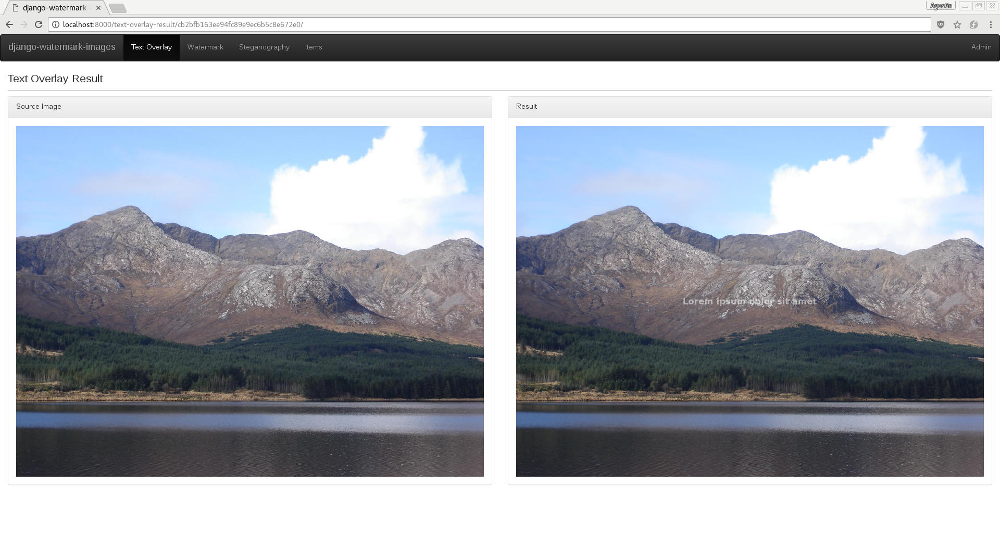
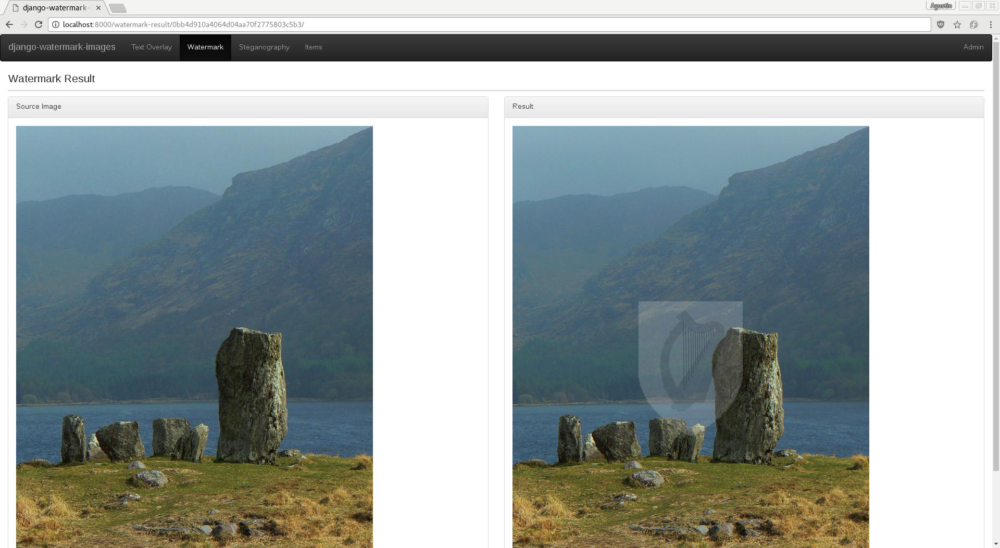

# Django Watermark Images

## Introduction

The purpose of this project is to illustrate how to add watermarks to images uploaded to a [Django](https://www.djangoproject.com/) site using [Pillow](https://python-pillow.org/) and [django-imagekit](https://github.com/matthewwithanm/django-imagekit). This project also show you how to add text overlays, visible watermarks and invisible watermarks using the LSB [steganography](https://en.wikipedia.org/wiki/Steganography) technique.

## How to Start 🏠

Clone this project and open the folder.

```bash
git clone https://github.com/ba1x/django-watermark-images.git
cd django-watermark-images
```

Create and enter the [Python environment](#python-environment).

```bash
python3 -m venv env     # create the python environment
. env/bin/activate      # enter to the environment
```

**Migrate** the database and **run** the webserver on **PORT 3000**.

```bash
./manage.py migrate         # start the project 
./manage.py runserver 3000  # run the webserver
```

## Screenshots





## Text Overlay

Text overlays are handled by the `add_text_overlay` function in the `processors.py` module. It uses Pillow's [Image](http://pillow.readthedocs.io/en/3.1.x/reference/Image.html), [ImageDraw](http://pillow.readthedocs.io/en/3.1.x/reference/ImageDraw.html), and [ImageFont](http://pillow.readthedocs.io/en/3.1.x/reference/ImageFont.html) modules to write semi-transparent text onto the original image to generate a new one:

```python
# items/processors.py

_default_font = ImageFont.truetype('/usr/share/fonts/dejavu/DejaVuSans-Bold.ttf', 24)

def add_text_overlay(image, text, font=_default_font):
    rgba_image = image.convert('RGBA')
    text_overlay = Image.new('RGBA', rgba_image.size, (255, 255, 255, 0))
    image_draw = ImageDraw.Draw(text_overlay)
    text_size_x, text_size_y = image_draw.textsize(text, font=font)
    text_xy = ((rgba_image.size[0] / 2) - (text_size_x / 2), (rgba_image.size[1] / 2) - (text_size_y / 2))
    image_draw.text(text_xy, text, font=font, fill=(255, 255, 255, 128))
    image_with_text_overlay = Image.alpha_composite(rgba_image, text_overlay)

    return image_with_text_overlay
```

An example on how to use `add_text_overlay` is shown in the `TextOverlay` Django view:

```python
# items/views.py

class TextOverlay(FormView):
    template_name = 'items/text_overlay.html'
    form_class = TextOverlayForm

    def form_valid(self, form):
        text = form.cleaned_data['text']
        image = Image.open(form.cleaned_data['image'])

        result_image = add_text_overlay(image, text)

        result_id = _create_result_id()
        _save_source_image(image, result_id)
        _save_result_image(result_image, result_id)

        return HttpResponseRedirect(reverse_lazy('text-overlay-result', kwargs={'result_id': result_id}))
```

The functionality can also be used in conjuction with imagekit's [ImageSpec](http://django-imagekit.readthedocs.io/en/latest/#using-specs-in-templates) using a custom processor:

```python
# items/processors.py

class TextOverlayProcessor(object):
    font = ImageFont.truetype('/usr/share/fonts/dejavu/DejaVuSans-Bold.ttf', 36)

    def process(self, image):
        return add_text_overlay(image, 'django-watermark-images', font=self.font)

class TextOverlay(ImageSpec):
    processors = [TextOverlayProcessor()]
    format = 'JPEG'
    options = {'quality': 75}

register.generator('items:text-overlay', TextOverlay)
```

Once the `ImageSpec` is registered, in can be used in templates:

```html
<div class="row item-row">
    <div class="col-lg-2 item-label">Text Overlay</div>
    <div class="col-lg-10"></div>
</div>
```

## Watermark

`add_watermark` also uses uses Pillow's [Image](http://pillow.readthedocs.io/en/3.1.x/reference/Image.html) API to combine the source image with the watermark making the latter greyscale and semi-transparent. It also scales the watermark if it is larger than the source image.

```python
# items/processors.py

def add_watermark(image, watermark, text, font=_default_font):
    rgba_image = image.convert('RGBA')

    # WATERMARK
    rgba_watermark = watermark.convert('RGBA')

    image_x, image_y = rgba_image.size
    watermark_x, watermark_y = rgba_watermark.size

    # Determine the scale size of the watermark
    temp_image = image_x/image_y
    temp_watermark = watermark_x/watermark_y
    temp = temp_watermark / temp_image

    # the constant value only works if:
    #  - watermark image has width > height
    #  - temp_watermark > temp_image
    constant_value = 1.071      

    # watermark fit to width
    scale_size = constant_value * temp

    watermark_scale = max(image_x / (scale_size * watermark_x), image_y / (scale_size * watermark_y))
    new_size = (int(watermark_x * watermark_scale), int(watermark_y * watermark_scale))
    rgba_watermark = rgba_watermark.resize(new_size)

    rgba_watermark_mask = rgba_watermark.convert("L").point(lambda x: min(x, 90))
    rgba_watermark.putalpha(rgba_watermark_mask)

    watermark_x, watermark_y = rgba_watermark.size
    rgba_image.paste(rgba_watermark, ((image_x - watermark_x) // 2, (image_y - watermark_y) // 2), rgba_watermark_mask)

    # TEXT OVERLAY
    text_position_vertical = 0.990
    text_overlay = Image.new('RGBA', rgba_image.size, (255, 255, 255, 0))
    image_draw = ImageDraw.Draw(text_overlay)
    text_size_x, text_size_y = image_draw.textsize(text, font=font)
    text_xy = ((rgba_image.size[0] / 2) - (text_size_x / 2), text_position_vertical * ((rgba_image.size[1]) - (text_size_y)))
    image_draw.text(text_xy, text, font=font, fill=(255, 255, 255, 128))
    image_with_text_overlay = Image.alpha_composite(rgba_image, text_overlay)

    return image_with_text_overlay

```

The function is used in the `Watermark` view:

```python
# items/views.py

class Watermark(FormView):
    template_name = 'items/watermark.html'
    form_class = WatermarkForm


    def form_valid(self, form):
        image = Image.open(form.cleaned_data['image'])
        watermark_image = Image.open(form.cleaned_data['watermark_image'])

        result_image = add_watermark(image, watermark_image)

        result_id = _create_result_id()
        _save_source_image(image, result_id)
        _save_result_image(result_image, result_id)

        return HttpResponseRedirect(reverse_lazy('watermark-result', kwargs={'result_id': result_id}))
```

Same as before, the function can also be used in templates registering an `ImageSpec` with a custom processor:

```python
# items/processors.py

class WatermarkProcessor(object):
    watermark = Image.open(settings.WATERMARK_IMAGE)

    def process(self, image):
        return add_watermark(image, self.watermark)

class Watermark(ImageSpec):
    processors = [WatermarkProcessor()]
    format = 'JPEG'
    options = {'quality': 75}

register.generator('items:watermark', Watermark)
```

```
<div class="row item-row">
    <div class="col-lg-2 item-label">Watermark</div>
    <div class="col-lg-10"></div>
</div>
```

## Hidden Watermark

Adding hidden watermarks is a bit more interesting. The data is encoded in the least significant bit of each pixel of the red channel of the original image. It is a rudimentary steganography technique, and it's fairly easy to implement using the [ImageMath](http://pillow.readthedocs.io/en/3.1.x/reference/ImageMath.html) module:

```python
# items/processors.py

def lsb_encode(data, image):
    bytes_io = BytesIO()
    dump(data, file=bytes_io)
    data_bytes = bytes_io.getvalue()
    data_bytes_array = np.fromiter(data_bytes, dtype=np.uint8)
    data_bits_list = np.unpackbits(data_bytes_array).tolist()
    data_bits_list += [0] * (image.size[0] * image.size[1] - len(data_bits_list))
    watermark = Image.frombytes(data=bytes(data_bits_list), size=image.size, mode='L')
    red, green, blue = image.split()
    watermarked_red = ImageMath.eval("convert(a&0xFE|b&0x1,'L')", a=red, b=watermark)
    watermarked_image = Image.merge("RGB", (watermarked_red, green, blue))
    return watermarked_image
```

In `lsb_encode` using [numpy](http://www.numpy.org/)'s `unpackbits` to make it easier to encode the data into the red channel using `ImageMath.eval` to replace the least significant bit of the red channel using the sequence of unpacked bits. We can use `lsb_decode` afterwards to extract the information from the resulting image:

```python
# items/processors.py

def lsb_decode(image):
    try:
        red, green, blue = image.split()
        watermark = ImageMath.eval("(a&0x1)*0x01", a=red)
        watermark = watermark.convert('L')
        watermark_bytes = bytes(watermark.getdata())
        watermark_bits_array = np.fromiter(watermark_bytes, dtype=np.uint8)
        watermark_bytes_array = np.packbits(watermark_bits_array)
        watermark_bytes = bytes(watermark_bytes_array)
        bytes_io = BytesIO(watermark_bytes)
        return load(bytes_io)
    except UnpicklingError:
        return ''
```

The function is used, as with the others, in a view:

```python
# items/views.py

class Steganography(FormView):
    template_name = 'items/steganography.html'
    form_class = SteganographyForm

    def form_valid(self, form):
        text = form.cleaned_data['text']
        image = Image.open(form.cleaned_data['image'])

        result_image = lsb_encode(text, image)

        result_id = _create_result_id()
        _save_source_image(image, result_id)
        _save_result_image(result_image, result_id)

        return HttpResponseRedirect(reverse_lazy('steganography-result', kwargs={'result_id': result_id}))
```

...and in a template using an `ImageSpec` and a processor:

```python
# items/processors.py

class HiddenWatermarkProcessor(object):
    def process(self, image):
        return lsb_encode('django-watermark-images', image)


class HiddenWatermark(ImageSpec):
    processors = [HiddenWatermarkProcessor()]
    format = 'PNG'


register.generator('items:hidden-watermark', HiddenWatermark)
```

```html
<div class="row item-row">
    <div class="col-lg-2 item-label">Hidden Watermark</div>
    <div class="col-lg-10"></div>
</div>
```

## Credits

This work is forked from [here](https://github.com/abarto/django-watermark-images).